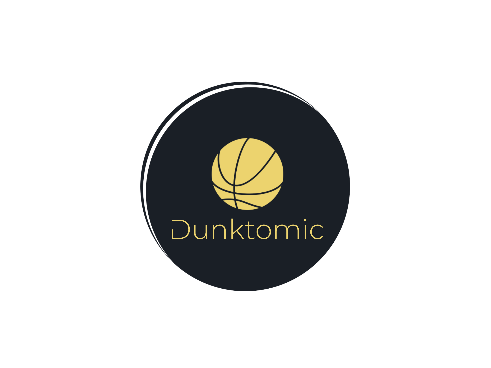
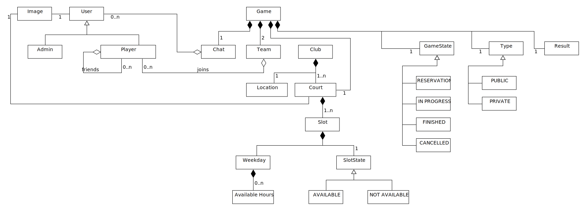
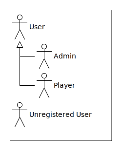
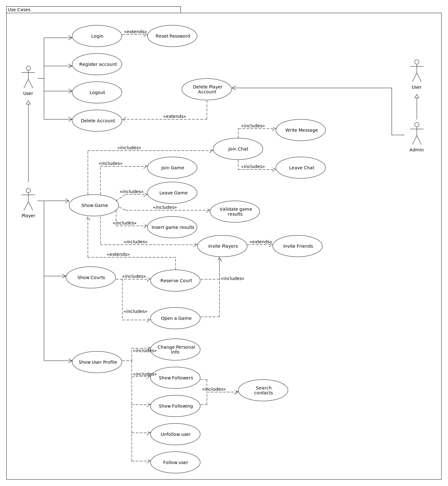

# Dunktomic

## Elevator pitch

"Dunktomic" eleva tu experiencia de deporte en España. Nuestra plataforma de “Reservas Eficientes” y el "Match Perfect" facilitan encuentros equilibrados y significativos, promoviendo un disfrute consciente del deporte. Vive tu pasión por el deporte utilizando Dunktomic.

## Requisitos funcionales

Con Dunktomic podrás buscar y reservar canchas cercanas a tí, pudiendo ajustar también la fecha y la hora.

Podrás gestionar partidos, reservando la pista, invitando a otros jugadores y gestionando confirmaciones de asistencia de los mismos.
Por otro lado, podrás observar tu desempeño, visualizando tu nivel así como las estadísticas de los partidos.

¡También podrás chatear con otros usuarios!

Y lo más importante, ¡podrás formar parte de una comunidad de jugadores con los que poder disfrutar de este deporte!

## Disciplina de Requisitos

Los diagramas han sido desarrollados usando [UMLet](https://www.umlet.com/), una herramienta UML open-source, y se pueden acceder importando los archivos <em>*.uxf</em>.

Como apoyo en el diagramado, se ha utilizado [Excalidraw](https://excalidraw.com), también open-source.

### Modelo del Dominio

### Actores

### Casos de Uso

### Análisis de Casos de Uso
TODO.
### Priorización de los Casos de Uso
TODO.
### Prototipos de la UI
TODO.

## Disciplina de Análisis y Diseño

### Análisis de la Arquitectura
TODO.
### Disciplina de Pruebas
TODO.
###

## Developer Dependencies

- JDK 17
- Maven 3.8.8
- Docker
- Umlet (dev)

## Deployment Dependencies

- Docker
