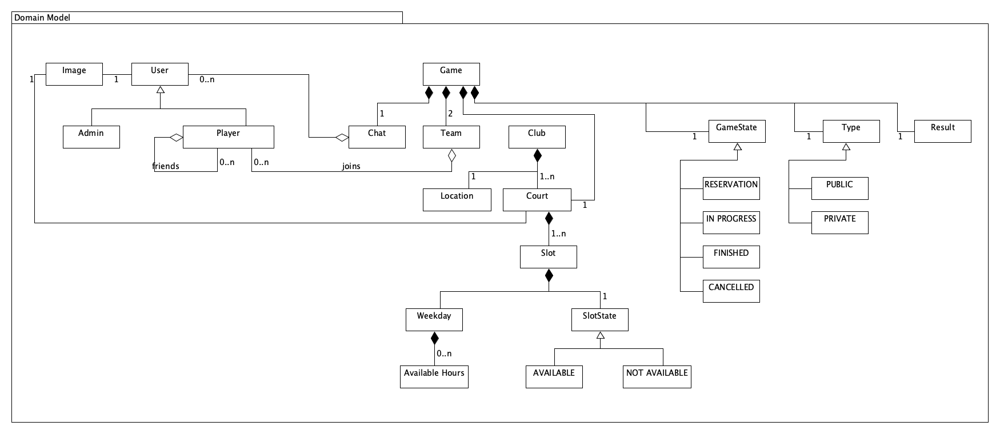
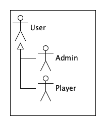
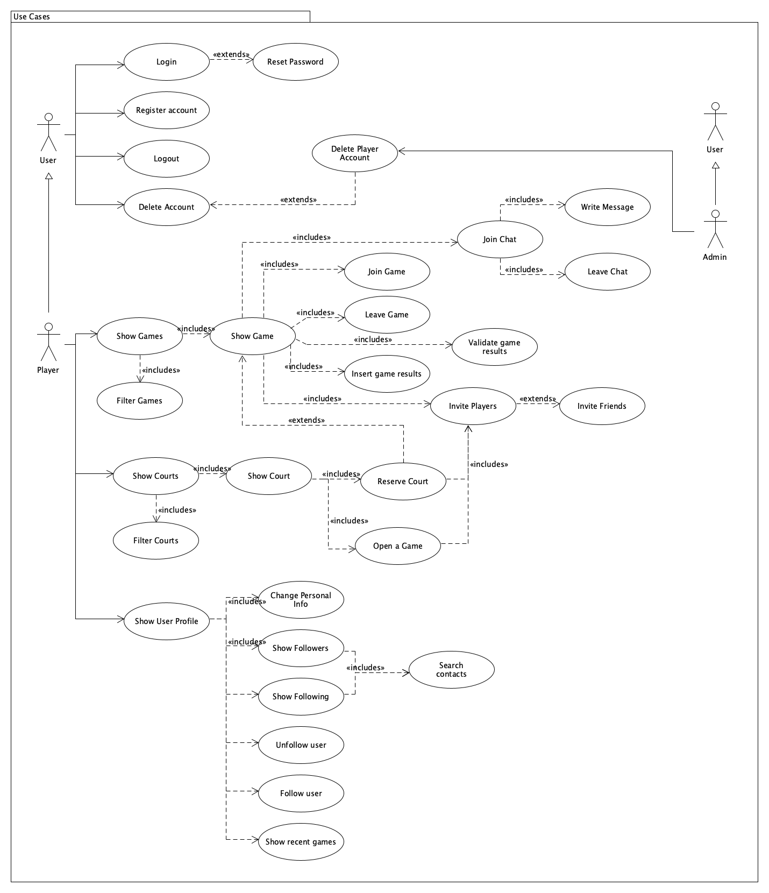

# Dunktomic
[](https://bump.sh/luisegui/doc/dunktomic)

<p align="center">

</p>

## Elevator pitch

"Dunktomic" eleva tu experiencia de deporte en España. Nuestra plataforma de “Reservas Eficientes” y el "Match Perfect" facilitan encuentros equilibrados y significativos, promoviendo un disfrute consciente del deporte. Vive tu pasión por el deporte utilizando Dunktomic.

## Requisitos funcionales

Con Dunktomic podrás buscar y reservar canchas cercanas a tí, pudiendo ajustar también la fecha y la hora.

Podrás gestionar partidos, reservando la pista, invitando a otros jugadores y gestionando confirmaciones de asistencia de los mismos.
Por otro lado, podrás observar tu desempeño, visualizando tu nivel así como las estadísticas de los partidos.

¡También podrás chatear con otros usuarios!

Y lo más importante, ¡podrás formar parte de una comunidad de jugadores con los que poder disfrutar de este deporte!

## Requisitos no funcionales

Se desea utilizar el siguiente stack tecnológico:
- Spring Framework
- Vue
- Docker
- Github Actions

## Despliegue

### Requisitos
Para el despliegue es necesario tener docker instalado.

Una vez instalado, se debe ejecutar sobre el directorio raiz del proyecto:

```bash
docker compose -f docker-compose up -d
```

A falta de incluir el servicio del frontend en el docker compose, se debe arrancar individualmente de la siguiente manera:

```bash
cd frontend/code
npm install
npm run dev
```

Podremos acceder desde el navegador a la ruta*:

```
http://localhost:5173/auth
```

*: en futuras iteraciones, el acceso seria a ```http://localhost:5173/```

## Disciplina de Requisitos

Los diagramas han sido desarrollados usando [UMLet](https://www.umlet.com/), una herramienta UML open-source, y se pueden acceder importando los archivos <em>*.uxf</em>.

Como apoyo en el diagramado, se ha utilizado [Excalidraw](https://excalidraw.com), también open-source.

### Modelo del Dominio


### Actores


### Casos de Uso


